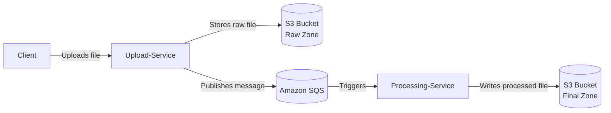

# File Upload Service Pipeline

## Overview
This project contains a Spring Boot microservice that uploads files to an Amazon S3 bucket and is intended to act as the entry point of a larger file-processing pipeline. Users send files through an HTTP endpoint, the service stores the raw object in S3, and a message queue notifies downstream processing services about the new file.

## Architecture


## Codebase Structure
- **`src/main/java/com/TuntuSK/upload_service/UploadServiceApplication.java`** – Spring Boot application entry point.
- **`src/main/java/com/TuntuSK/upload_service/UploadController.java`** – REST controller exposing `/api/v1/uploads` for file submissions.
- **`src/main/java/com/TuntuSK/upload_service/S3Service.java`** – Wrapper around AWS S3 client for uploading files and generating presigned URLs.
- **`src/test/java/com/TuntuSK/upload_service/UploadServiceApplicationTests.java`** – Basic Spring Boot context test placeholder.

## Features
- Accepts multipart file uploads and stores each file in a configured S3 bucket with a UUID-based name.
- Generates presigned GET and PUT URLs for retrieving or uploading objects without direct credentials.
- Designed to publish SQS messages for further asynchronous processing (queue integration not yet implemented in code).

## Prerequisites
- Java 21+
- Maven 3.9+
- AWS credentials with access to the target S3 bucket.
- Environment property `app.aws.s3.bucket-name` defining the destination bucket.

## Running Locally
1. Ensure a `pom.xml` with Spring Boot and AWS SDK dependencies exists in the project root.
2. Build the service:
   ```bash
   mvn clean package
   ```
3. Run the application:
   ```bash
   mvn spring-boot:run
   ```

## API Usage
### `POST /api/v1/uploads`
Uploads a file to S3.
- **Request:** multipart form field named `file` containing the file to upload.
- **Response:** unique object key of the uploaded file.

Example:
```bash
curl -F "file=@path/to/file.jpg" http://localhost:8080/api/v1/uploads
```

## Testing
Run unit tests with Maven:
```bash
mvn test
```

## Future Enhancements
- Implement SQS message publication after successful upload.
- Add endpoint for presigned URL generation.
- Expand test coverage.
