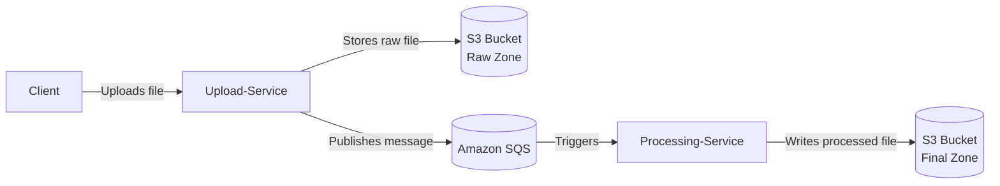

# File Upload Service Pipeline

## Overview
The File Upload Service is a Spring Boot microservice that ingests files and places them in an Amazon S3 bucket for later processing. It acts as the front door of a broader pipeline: clients upload raw files, the service persists them, and downstream workers are notified through a queue (SQS planned) to continue the workflow.

## Architecture


## Codebase Structure
- **`src/main/java/com/TuntuSK/upload_service/UploadServiceApplication.java`** – Spring Boot application entry point.
- **`src/main/java/com/TuntuSK/upload_service/UploadController.java`** – REST controller exposing `/api/v1/uploads` for file submissions.
- **`src/main/java/com/TuntuSK/upload_service/S3Service.java`** – Wrapper around AWS S3 client for uploading files and generating presigned URLs.
- **`src/test/java/com/TuntuSK/upload_service/UploadServiceApplicationTests.java`** – Basic Spring Boot context test placeholder.

## Features
- Accepts multipart file uploads and stores each file in a configured S3 bucket with a UUID-based name.
- Generates presigned GET and PUT URLs for retrieving or uploading objects without direct credentials.
- Designed to publish SQS messages for further asynchronous processing (queue integration not yet implemented in code).

## Prerequisites
- Java 21+
- Maven 3.9+
- AWS credentials with access to the target S3 bucket
- Network access to Amazon S3

## Configuration
1. Create or update `src/main/resources/application.properties`:
   ```properties
   # HTTP server port
   server.port=8080

   # Bucket receiving uploaded files
   app.aws.s3.bucket-name=your-upload-bucket

   # AWS region of the bucket (optional; falls back to SDK default)
   app.aws.region=us-east-1
   ```
2. Supply AWS credentials. The service relies on the [AWS SDK default credential provider chain](https://docs.aws.amazon.com/sdk-for-java/v2/developer-guide/credentials.html); any of the following work:
   - Environment variables `AWS_ACCESS_KEY_ID`, `AWS_SECRET_ACCESS_KEY`, and optionally `AWS_SESSION_TOKEN` and `AWS_REGION`
   - An entry in `~/.aws/credentials` selected via `AWS_PROFILE`
   - EC2/ECS instance roles or other IAM roles attached to the runtime environment
3. (Optional) Override properties with environment variables, e.g. `APP_AWS_S3_BUCKET_NAME` or `APP_AWS_REGION` for containerized deployments.

## Running Locally
1. Configure properties and credentials as described above.
2. Build the service:
   ```bash
   mvn clean package
   ```
3. Start the application:
   ```bash
   mvn spring-boot:run
   ```

## API Usage
### `POST /api/v1/uploads`
Uploads a file to S3.
- **Request:** multipart form field named `file` containing the file to upload.
- **Response:** unique object key of the uploaded file.

Example:
```bash
curl -F "file=@path/to/file.jpg" http://localhost:8080/api/v1/uploads
```

## Testing
Run unit tests with Maven:
```bash
mvn test
```

## Future Enhancements
- Implement SQS message publication after successful upload.
- Add endpoint for presigned URL generation.
- Expand test coverage.
